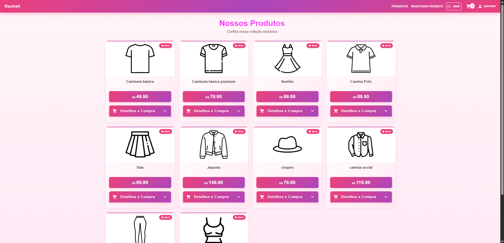
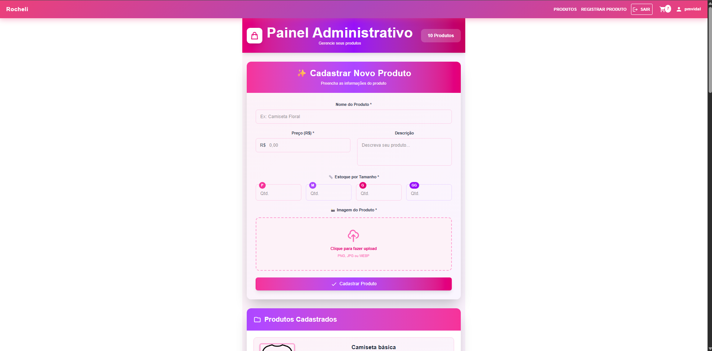

# 🛍️ Rochelli Store

### E-commerce de Vestuário Full Stack

Aplicação web de **e-commerce de vestuário**, desenvolvida como projeto Full Stack utilizando a stack **MERN — MongoDB, Express, React e Node.js**.

O sistema simula o funcionamento de uma loja virtual, permitindo o gerenciamento de produtos, navegação pelo catálogo, autenticação de usuários e um fluxo simulado de processamento e envio de pedidos.

---

# 🎯 Sobre o projeto

O **Rochelli Store** foi desenvolvido com o objetivo de consolidar conhecimentos em **desenvolvimento Full Stack, arquitetura de software, APIs, autenticação, banco de dados e regras de negócio**.

A aplicação foi estruturada utilizando o padrão arquitetural **MVC (Model, View e Controller)**, separando as responsabilidades entre as diferentes camadas do sistema.

O projeto simula uma plataforma de comércio eletrônico, conectando:

```text
Frontend
   │
   ▼
API / Backend
   │
   ▼
Banco de Dados
```

Essa estrutura permite que as informações cadastradas no sistema sejam persistidas e utilizadas pela interface da loja.

---

# ✨ Principais funcionalidades

## 🛍️ Catálogo de produtos

A aplicação possui uma área destinada à navegação da loja, onde os usuários podem visualizar os produtos disponíveis.

Os produtos possuem informações relacionadas ao vestuário e suas respectivas opções de tamanho.

### Tamanhos disponíveis

* P
* M
* G
* GG

---

## ⚙️ Gerenciamento de produtos

O sistema possui uma área destinada ao gerenciamento dos produtos cadastrados.

É possível trabalhar com informações relacionadas aos produtos de vestuário e sua disponibilidade por tamanho.

Essa funcionalidade representa a área administrativa da aplicação.

---

## 🔐 Autenticação

O Rochelli Store possui autenticação de usuários.

As senhas são protegidas utilizando **bcrypt**, evitando que sejam armazenadas diretamente em texto puro.

```text
Usuário
   │
   ▼
Senha
   │
   ▼
bcrypt
   │
   ▼
Armazenamento seguro
```

---

## 📦 Fluxo de envio

O projeto possui um sistema de envio desenvolvido de forma **simulada**, representando as etapas relacionadas ao processamento e envio dos pedidos.

A funcionalidade foi desenvolvida com o objetivo de reproduzir parte do fluxo encontrado em uma aplicação de comércio eletrônico real.

---

## 🔗 Integração Full Stack

Uma das principais características do projeto é a integração entre as diferentes camadas da aplicação.

```text
             React
               │
               ▼
         Requisições HTTP
               │
               ▼
            Express
               │
               ▼
        Regras de negócio
               │
               ▼
            MongoDB
```

Essa integração permite que ações realizadas na interface sejam processadas pelo backend e persistidas no banco de dados.

---

# 📸 Demonstração

## 🛍️ E-commerce de Vestuário

Visão geral da aplicação de e-commerce, apresentando a interface da loja e a experiência de navegação pelos produtos disponíveis.

<!-- SUBSTITUA pelo caminho da imagem -->



---

## ⚙️ Gerenciamento de Produtos

Área utilizada para cadastrar e administrar os produtos da loja, incluindo informações de vestuário e disponibilidade por tamanho.

<!-- SUBSTITUA pelo caminho da imagem -->



---

## 👕 Catálogo de Produtos

Interface da loja para visualização dos produtos de vestuário disponíveis, com organização das opções e respectivos tamanhos.

<!-- SUBSTITUA pelo caminho da imagem -->


---

# 🏗️ Arquitetura

O projeto foi desenvolvido utilizando o padrão arquitetural **MVC — Model, View e Controller**.

A separação das responsabilidades permite organizar melhor o código e facilita a manutenção e evolução da aplicação.

```text
                    Aplicação
                       │
          ┌────────────┴────────────┐
          │                         │
        View                     Backend
          │                         │
       React                       │
                                    │
                       ┌────────────┴────────────┐
                       │            │            │
                     Model      Controller      Routes
                       │            │            │
                       └────────────┼────────────┘
                                    │
                                    ▼
                                 MongoDB
```

### Model

Responsável pela estrutura e interação dos dados da aplicação.

### Controller

Responsável pelo processamento das requisições e aplicação das regras necessárias.

### View

Representada pela aplicação React, responsável pela interface e interação com o usuário.

---

# 🧠 Principais desafios

Um dos principais objetivos do projeto foi compreender como diferentes partes de uma aplicação Full Stack se comunicam.

Durante o desenvolvimento, os principais desafios envolveram:

### 🔗 Integração Frontend e Backend

Foi necessário estruturar a comunicação entre React e Node.js/Express através de APIs.

```text
React
  │
  │ HTTP
  ▼
Express
  │
  ▼
Controllers
  │
  ▼
Models
  │
  ▼
MongoDB
```

---

### 🗄️ Persistência de dados

Os dados da aplicação precisam permanecer disponíveis mesmo após o encerramento da sessão.

Por isso, o projeto utiliza MongoDB para armazenar as informações relacionadas à aplicação.

---

### 🔐 Autenticação e segurança

Outro ponto importante foi trabalhar com autenticação e proteção das senhas utilizando bcrypt.

Isso permitiu aplicar conceitos básicos de segurança no desenvolvimento de aplicações web.

---

### 🏛️ Organização arquitetural

A utilização do padrão MVC trouxe o desafio de separar corretamente as responsabilidades de cada parte da aplicação.

Essa organização ajudou a compreender melhor como estruturar projetos Full Stack maiores do que uma aplicação concentrada apenas no frontend.

---

# 🛠️ Tecnologias utilizadas

### Front-end

* React
* JavaScript

### Back-end

* Node.js
* Express

### Banco de dados

* MongoDB

### Arquitetura

* MVC

### Segurança

* bcrypt

### Desenvolvimento

* Git
* GitHub

---

# 🔄 Fluxo principal da aplicação

O fluxo principal pode ser representado da seguinte forma:

```text
                  USUÁRIO
                     │
                     ▼
              Acessa a loja
                     │
                     ▼
             Visualiza produtos
                     │
                     ▼
              Seleciona produto
                     │
                     ▼
              Escolhe tamanho
                     │
                     ▼
             Fluxo de pedido
                     │
                     ▼
             Processamento
                     │
                     ▼
            Envio simulado
```

Enquanto isso, a área administrativa possui um fluxo separado:

```text
               ADMINISTRADOR
                     │
                     ▼
             Gerenciamento
                     │
                     ▼
              Produtos
                     │
          ┌──────────┴──────────┐
          ▼                     ▼
       Cadastro            Atualização
          │                     │
          └──────────┬──────────┘
                     ▼
                 MongoDB
```

---

# 📚 O que desenvolvi com este projeto

O Rochelli Store foi desenvolvido principalmente para consolidar conhecimentos relacionados ao desenvolvimento **Full Stack**.

Durante o projeto, trabalhei com:

* React
* JavaScript
* Node.js
* Express
* MongoDB
* APIs
* Arquitetura MVC
* Autenticação
* bcrypt
* Persistência de dados
* Regras de negócio
* Integração frontend/backend
* Desenvolvimento de aplicações web

O projeto também ajudou a compreender melhor como diferentes camadas de uma aplicação trabalham em conjunto, desde a interface utilizada pelo usuário até a persistência das informações no banco de dados.

---

# 🚀 Possíveis evoluções

Por se tratar de uma aplicação desenvolvida para consolidar conhecimentos de Full Stack, existem diversas possibilidades de evolução.

Entre elas:

* Carrinho de compras mais completo
* Integração com meios de pagamento
* Sistema de pedidos mais robusto
* Rastreamento de pedidos
* Melhorias no gerenciamento de estoque
* Filtros e busca de produtos
* Melhorias na área administrativa
* Sistema de avaliações
* Melhorias na experiência do usuário

---

# 👨‍💻 Desenvolvedor

**Paulo Miguel**

Estudante de Engenharia de Software e Desenvolvedor Full-Stack em formação.

🔗 **GitHub:** PauloMiguelVIdal
🔗 **LinkedIn:** https://www.linkedin.com/in/paulo-miguel-vidal-da-silva/

---

# 🛍️ Projeto

**Rochelli Store — E-commerce de Vestuário Full Stack**

Projeto desenvolvido entre **maio de 2025 e janeiro de 2026** como parte da minha evolução no desenvolvimento de aplicações Full Stack.
